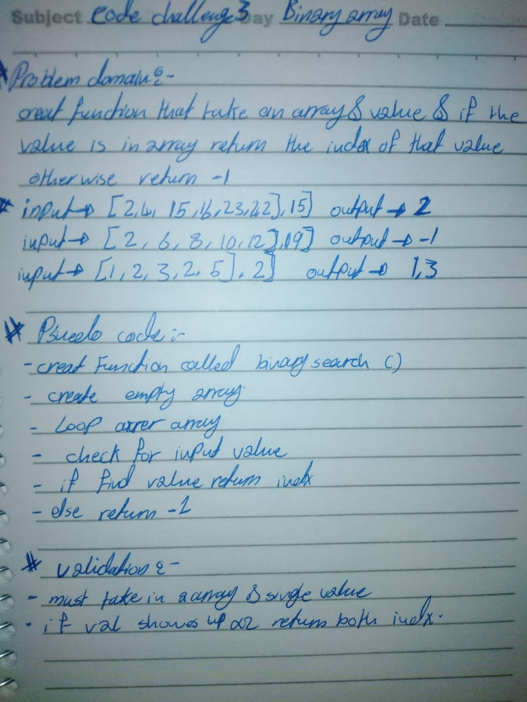

# Reverse an Array
Write a function that takes in a array and value, and check if that value appears in the array.
return the index location of where that value appears.
ex. `BianarySearch([1,2,3], 2)` should `return 1`.

## Challenge
1-Write a function called BinarySearch which takes in 2 parameters: a sorted array and the search key. 

2-return the index of the array’s element that is equal to the search key

3-return or -1 if the element does not exist.

## Approach & Efficiency

1-Created a function called bianary search that took in a array and a value. 

2- Then created a empty array and a variable called idx that stored the value 0. 

3- in the loop array values equaled the value inputed to the function.

4- If it did we would push the index to the empty array and increase the variable idx by one. 

5- then check the idx number at the end and based our return value off of that. 
 

## Solution
