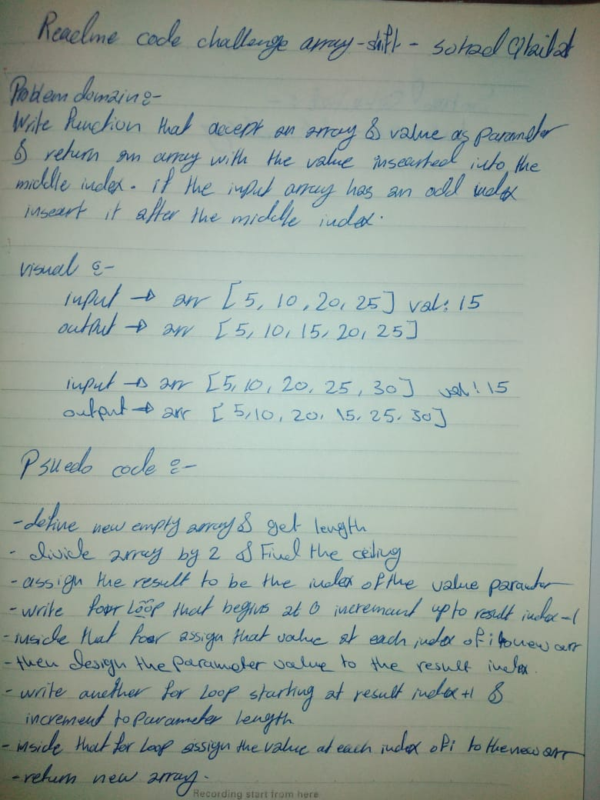

# Insert and shift middle index of array
This is code challenge number 2 for JS 401

## Challenge
The challenge for today was to write a function that given and array and a value, inserts that value into the middle of the array. It should return an array with the value in the middle index position (rounded up in the case of an odd number of indexes).

## Approach & Efficiency

1) determine the middle index by dividing the length of the array by 2 and rounding up in centerIdx.

2) loop through the first half of the array assigning each value of the original array 

3) assign the centerIdx value the value given in the newArray

4) loop through the second part of the array assigning the remaining values to the new array then  return the newArray.

## Solution
