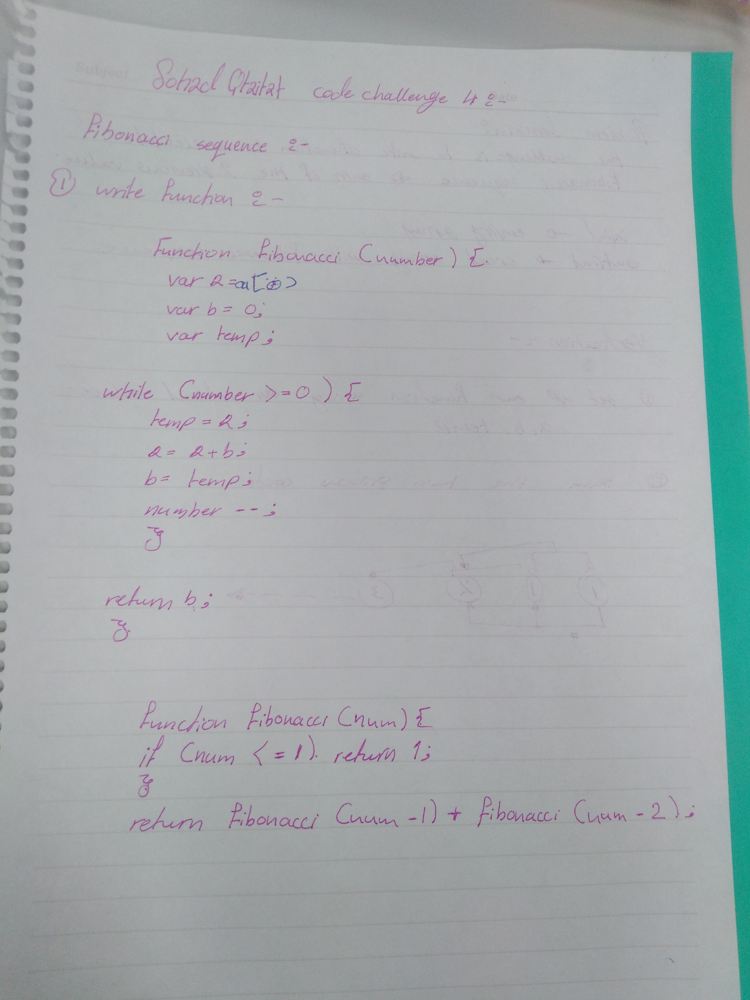

# Insert and shift middle index of array
This is code challenge number 4 for Fibonacci sequence

# sohad Qtaitat

## Challenge

Example CodeScreen JavaScript (Node.js) assessment that requires the candidate to return the nth element in the Fibonacci sequence.

The sequence is assumed to be 0-indexed, with fibonacci(0) returning 0 and fibonacci(1) returning 1.

The class to write this method in is fibonacci.js.

The tests that are run and are visible to the candidate  in tests/fibonacci.test.js.

The tests that are run and are not visible to the candidate are located in tests/fibonacci.hidden.test.js.

Given a number N return the index value of the Fibonacci sequence, where the sequence is:
1, 1, 2, 3, 5, 8, 13, 21, 34, 55, 89, 144, ...
After a quick look, you can easily notice that the pattern of the sequence is that each value is the sum of the 2 previous values, that means that for N=5 → 2+3 or in maths:
F(n) = F(n-1) + F(n-2)

## Solution

1.jpg)