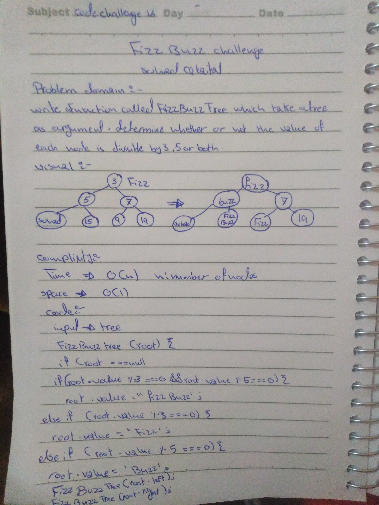

## Challenge
Write a function called FizzBuzzTree which takes a tree as an argument.
Without utilizing any of the built-in methods available to your language, determine whether or not the value of each node is divisible by 3, 5 or both. Create a new tree with the same structure as the original, but the values modified as follows:

*If the value is divisible by 3, replace the value with “Fizz”
*If the value is divisible by 5, replace the value with “Buzz”
*If the value is divisible by 3 and 5, replace the value with “FizzBuzz”
*If the value is not divisible by 3 or 5, simply turn the number into a String.

## Approach & Efficiency
 The Tree class objects have a constructor that build a tree with a root node of a given value. Both `tree.js` and `binary-search-tree.js` make use of Node class objects that have variables to reference a value, a left node, and a right node. 

# FizzBuzz
A function that replaces certain numbers with strings

## Approach & Efficiency
The function uses a preOrder recursive function to traverse the tree and checks for a mod (%) of 0 to replace the numbers

## complixity 
time O(n)
space O(1)

## Solution

