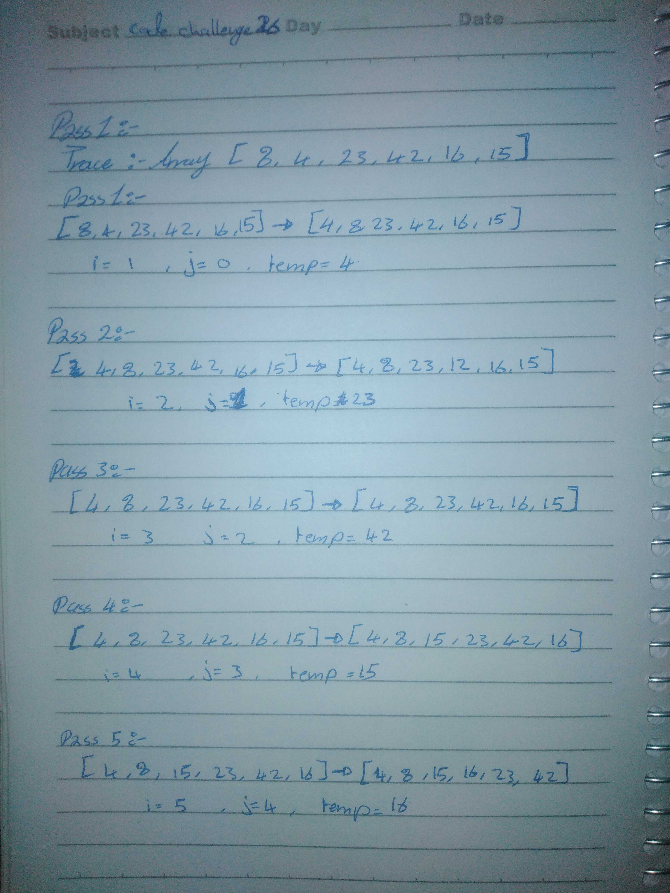

# Insertion Sort 
## Challenge Description
Review the pseudocode , then trace the algorithm by stepping through the process with the provided sample array.Document the explanation by creating a blog article that shows the step-by-step output after each iteration through some sort of visual.

## Approach & Efficiency
<!-- What approach did you take? Why? What is the Big O space/time for this approach? -->
- Time: O(n^2)
- Space: O(1)

## Solution
