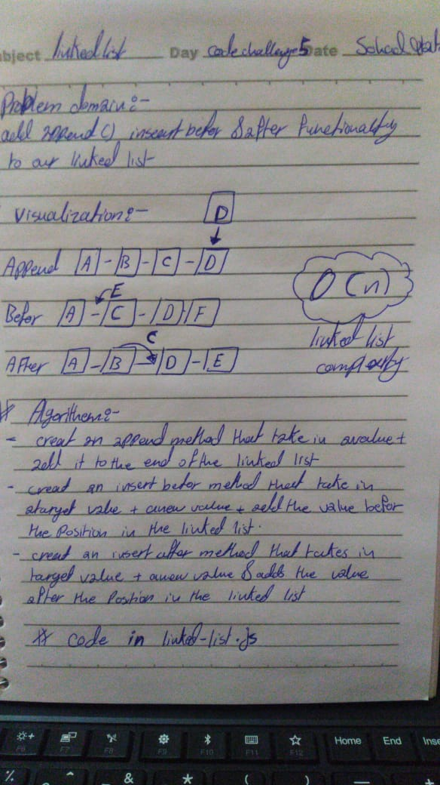

# Singly Linked List
This demonstrates a class constructor of a singly Linked List

## sohad Qtaitat

## Challenge
 create a linked list using classes.

*Methods on the Linked List include: 
1- insert a value to the linked list
2-search to see if a value exists in a linked list
3- print the entire linked list

## Approach & Efficiency

I first determine if this is the first value added to the list if it is, this becomes the head.
 If it isn't, I loop through the list looking for the value where the next is null (This is the last node)
 
  I then set the new value to that next node. The big O for for this apprach is O(n) due to the unknown length of the node list.

## Solution

