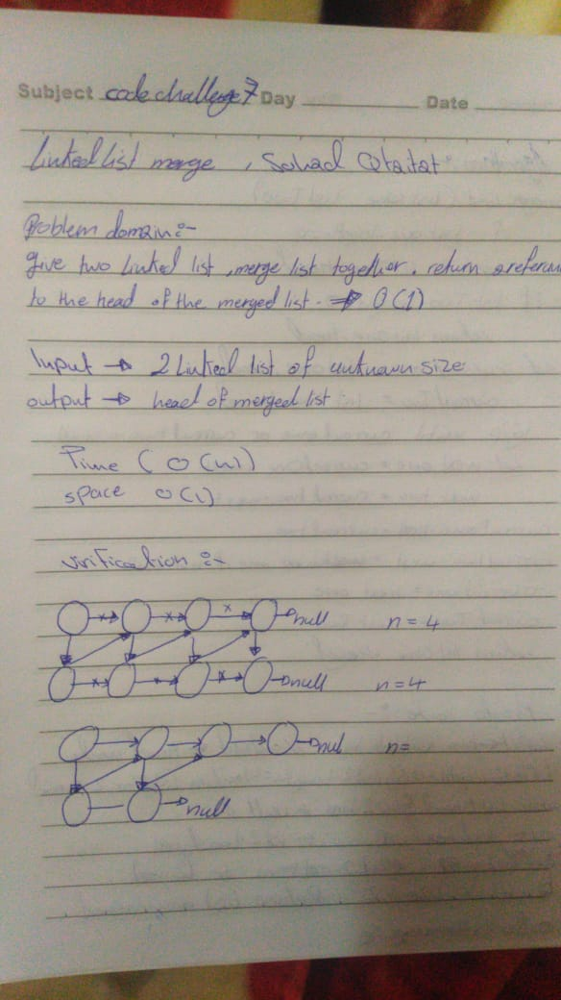
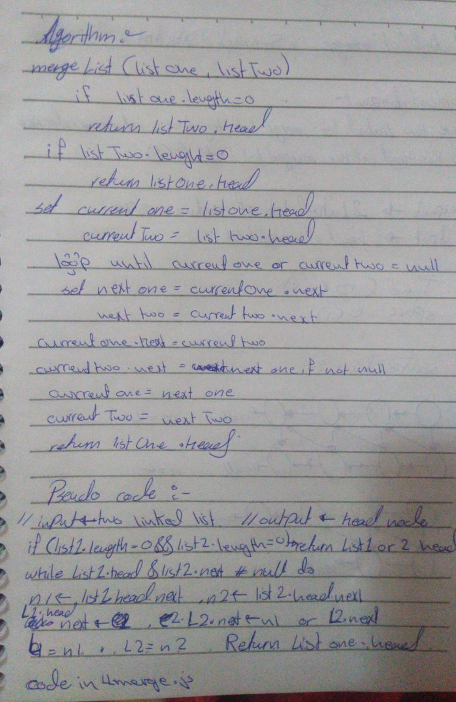

# data-structures-and-algorithms

# Singly Linked List
- Short brief how it's work and linked to each other as a object chain 

## Challenge
- Utilize any methods you write should be clean, reusable, abstract component parts to the whole challenge.

# Linked List Insertions
These methods insert new node into the array, either before or after a target node.

## Approach & Efficiency
These use while loops to traverse the list.  The worst case would be to traverse the whole length of the array, so the time would be O(n).

## API
- insertAfter : Insert node after given value 
- insert : Create new Node and add it at first
- to string : convert all list items to string 
- includes : find certain node 
- Append : add new node to the end of the list
- insertBefore : Insert Node before another Node

## `.mergeLists(list1, list2)`
Takes in two linked lists and zips them together, alternating nodes into one large list.

### Approach & Efficiency
Tracking variable are assigned to the head node for both lists. two tracking variables are assigned to the nodes referenced by the `.next` properties of the current nodes.  The next of the first node is assign to the current node of the second list, and the next of the second node is assigned to the next of the first list's node. 
 This repeats until the end of one list is found, where the remaining list will continue.

### Whiteboard

