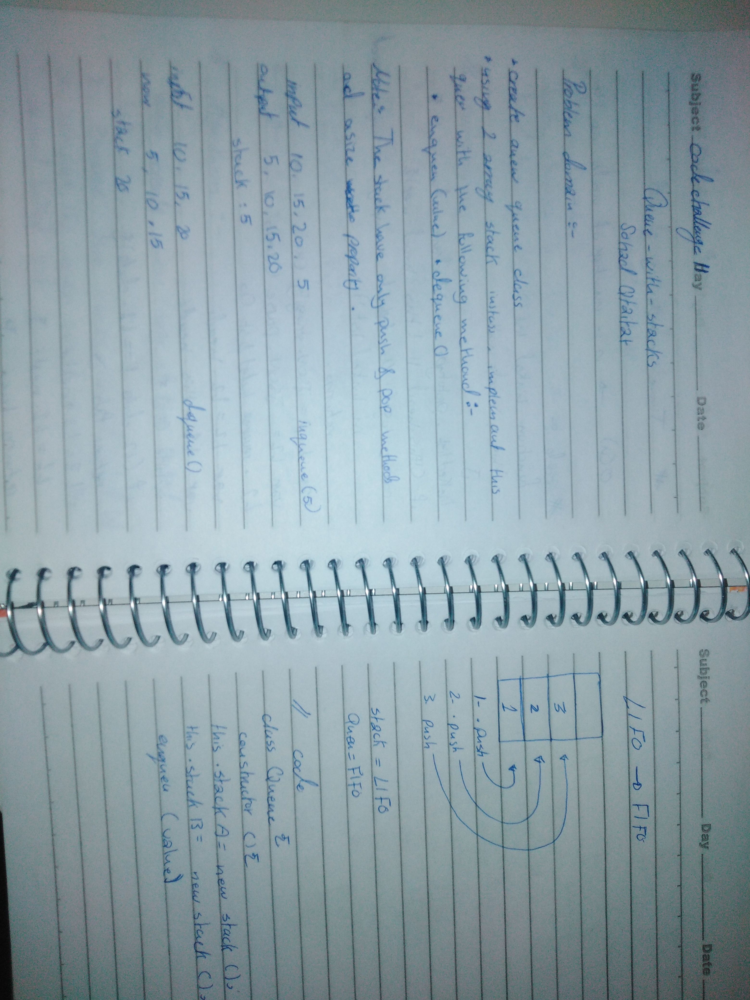

## Problem

Queues normally behave FIFO  and stacks as LIFO . As a result, trying to use a stack like a queue will not compute. However, if we look at the problem in a different way we can mimic this behavior for the sake of demonstration and exercise.

### Algo & Features

To do this efficiently, we will need 2 stacks. enqueue(value) will be pushed (unshifted) into stackA. Upon dequeue(), stackA will spill over into stackB for LIFO to FIFO re-arrangement. dequeue() will then pop values off of stackB in FIFO arrangement.

### Tests Performed with Jest
- perform an enqueue 5x should leave the 2nd value, postion [1], as 4.
- perform a dequeue once move stackA (LIFO) to stackB (FIFO) and pop first value.
- perform enqueue, dequeue, and clearQueue to check for return of 0 length

### Installing

To use this in your code:

- git clone repo 
- npm install 
- require('../queue-with-stacks');

## Built With

* Node
* Eslint
* jest

## Authors

 

