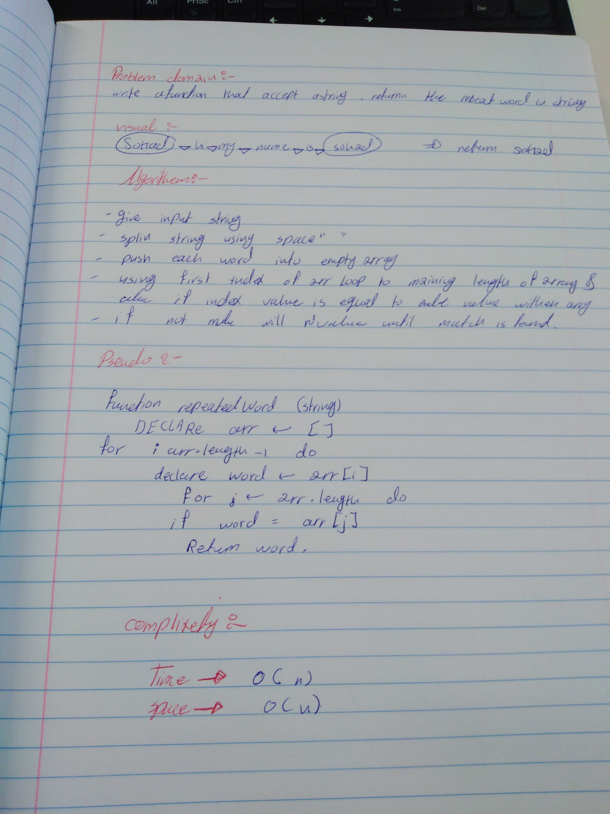

# First repeated word
 * Find the first repeated word in a book.

## sohad Qtaitat

## Challenge
 * Write a function that accepts a lengthy string parameter.
 
 * Without utilizing any of the built-in library methods available to your language, return the first word to occur more than once in that provided string.

## Approach & Efficiency
 * push the string into an array on each space and convert it to lowercase. 
 * then iterate through the array, and iterate through again inside of the first loop, thereby comparing each element to any other elements and have it return a match as soon as one is found.

## Solution
