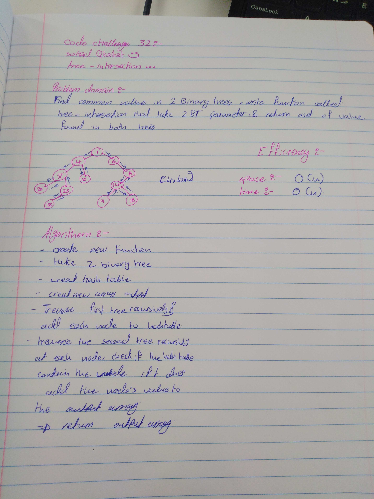

# Intersection of binary trees
## challenge 32 sohad Qtaitat
This challenge encourages the use of a hashtable data structure, in order to leverage its quick lookup times.

## Challenge
* Write a function called `tree_intersection` that takes two binary tree parameters.
* Without utilizing any of the built-in library methods available to your language, return a set of values found in both trees.

## Approach & Efficiency
I decided to leverage the quick lookup time of a hashtable to complete this challenge. Our algorithm traverses the first tree and adds all its values to a hashtable. Then traverse the second tree and, as visit each node, check if the value is in the hash table; if it is,add it to our output array. 

The time and space efficiency for this algorithm is O(n).

## Solution
